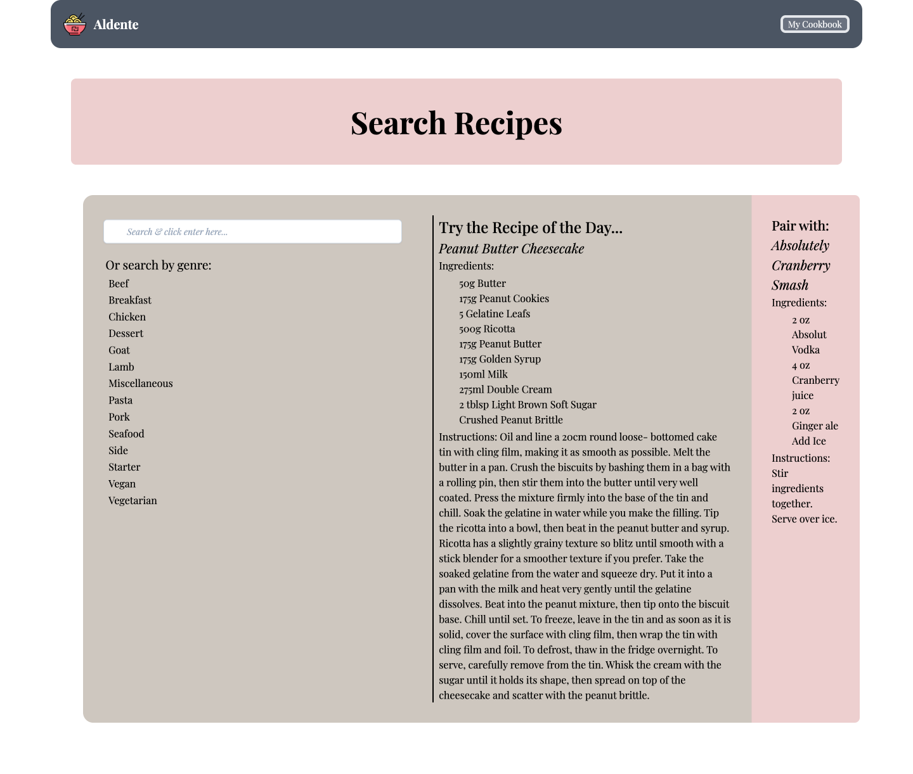

# Al Dente

## Description
This application is designed to help anyone and everyone looking for a simple and organized way to search for and save recipes. It features four different pages, including a home page, a results page, a recipe page, and "My Cookbook", which displays the user's saved recipes. This application was created using JQuery UI, TailwindCSS, Moment.js, and two APIs: TheMealDB and TheCocktailDB. 

## Acceptance Criteria
1. When the user is on the home page, they are presented with a Recipe of the Day and a drink to pair with it.
2. On the home page, the user can also search for a recipe from a variety of genres. They can either search by genre or type a recipe name/ingredient into the search bar.
3. When the user searches by genre, they are brought to a results page that gives them a few options to choose from within the selected genre. When the user selects a recipe, they are brought to a page showing the instructions and ingredients for the chosen recipe.
4. When the user types into the search bar, an autocomplete menu shows them recipe options to choose from. When the user searches, they are brought to a page showing the instructions and ingredients for the chosen recipe.
5. If a user wants to save a recipe, they can do so, and it will save in a list on their cookbook page.

## Screenshot of Application

## Deployed Application
Click [here](https://ripbog.github.io/groupproject1/index.html) for Al Dente's live URL.

Click [here](https://github.com/ripbog/groupproject1) for our GitHub Repository.